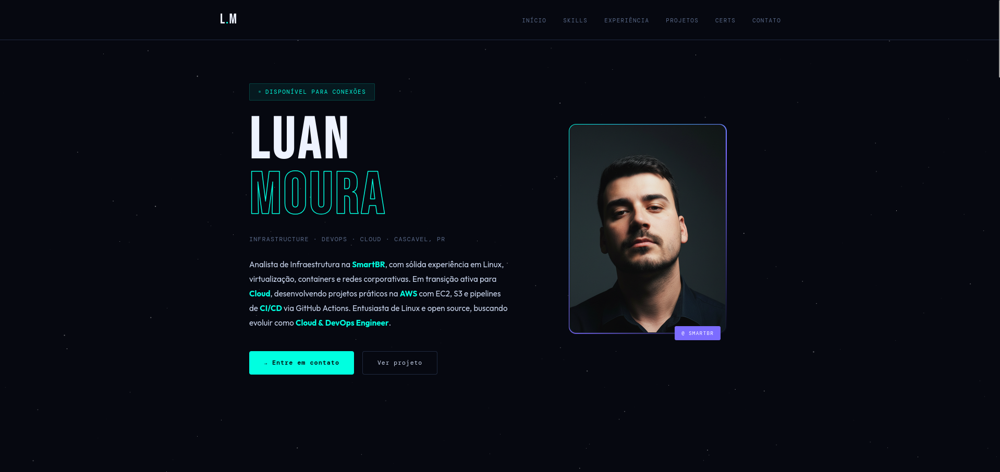

# 🌌 Night DevOps Portfolio

[🔗 Clique aqui para ver o site ao vivo](https://E32YSCS1PNI95Y.cloudfront.net)

Este é um projeto de portfólio pessoal desenvolvido com foco em **Modern Infrastructure** e **SecOps**. O objetivo principal foi criar uma vitrine pública que demonstra competências em automação de nuvem, segurança de dados e CI/CD.

## 🚀 Arquitetura de Infraestrutura

O site é hospedado seguindo o padrão de mercado para alta disponibilidade e performance:
- **Storage:** AWS S3 (Static Website Hosting).
- **CDN:** AWS CloudFront para distribuição global e HTTPS.
- **DNS:** Gerenciamento de rota e cache.

## 🛡️ Diferenciais de SecOps (Segurança)

Como o repositório é público, implementei camadas de segurança para proteger informações sensíveis:

1. **OIDC (OpenID Connect):** Não utilizo Access Keys estáticas no GitHub. A autenticação com a AWS é feita via Trust Relationship federada, eliminando o risco de vazamento de credenciais.
2. **Dynamic Secret Injection:** Dados pessoais (E-mail e Telefone) **não estão no código fonte**. Eles são injetados dinamicamente no `index.html` durante o runtime do pipeline de CI/CD utilizando `sed` e variáveis de ambiente seguras.
3. **Princípio do Menor Privilégio:** A Role do IAM utilizada pelo GitHub Actions possui permissões restritas apenas ao bucket de destino e à invalidação de cache do CloudFront.

## ⚙️ Esteira de CI/CD (GitHub Actions)

O arquivo `.github/workflows/deploy.yml` gerencia todo o ciclo de vida:
- **Checkout:** Coleta do código fonte.
- **Sanitize & Inject:** Injeção dos segredos PII (Personally Identifiable Information).
- **AWS Auth:** Autenticação temporária via OIDC.
- **S3 Sync:** Upload dos arquivos com exclusão de metadados do Git e assets privados.
- **Invalidation:** Limpeza automática do cache do CloudFront para atualização instantânea.

## 🛠️ Tecnologias Utilizadas

- **Cloud:** AWS (S3, CloudFront, IAM).
- **CI/CD:** GitHub Actions.
- **Scripting:** Bash/Shell para manipulação de arquivos em runtime.
- **Frontend:** HTML5, CSS3 (Custom Properties), JavaScript.

---
Desenvolvido por [Luan Moura](https://www.linkedin.com/in/luanfelp96) - Analista de Infraestrutura e Redes.
